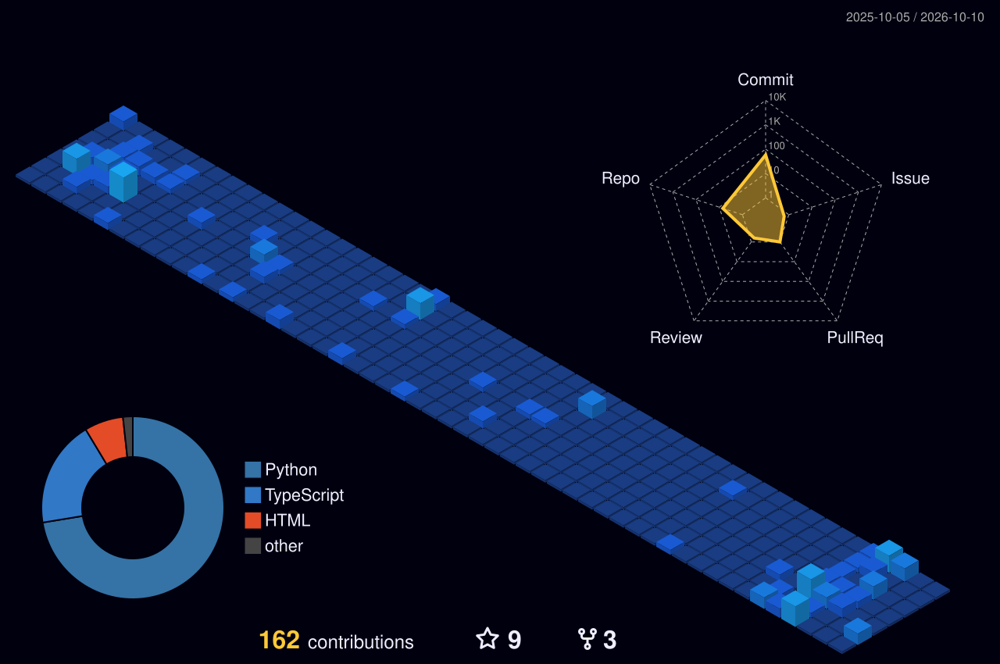

  

  <h1>Hi there, I'm McDonald! 👋</h1>
  <h3>Software Engineer | Pythonist | Technical Writer</h3>

  

   
   
  

---

### 👨‍💻 About Me

- ⚙️ **Software Engineering:** Specializing in backend development, API architecture, and database management.
- 🐍 **Pythonist:** Deeply passionate about building robust systems and exploring new technologies 🌱.
- 👾 **Collaborative Spirit:** Always open to collaborating on exciting projects and contributing to the developer community.
- 🌍 **Polyglot:** Fun fact—I speak both English and Spanish! 😋

---

### 🛠️ My Tech Arsenal

  
  
  
  
  
  
  
  

---

### ✍️ Latest Medium Articles

<!-- BLOG-POST-LIST:START -->
- [D I S K O V A F R I K A](https://medium.com/@mcdonaldsamure91/d-i-s-k-o-v-a-f-r-i-k-a-340dfaec3c08?source=rss-d43c4b961845------2)
- [The Advent of Artificial Intelligence](https://medium.com/@mcdonaldsamure91/the-advent-of-artificial-intelligence-adea2baf58a7?source=rss-d43c4b961845------2)
- [My First Postmortem](https://medium.com/@mcdonaldsamure91/my-first-postmortem-25616e7e6c8b?source=rss-d43c4b961845------2)
- [What happens when you type google.com in your browser and press Enter?](https://medium.com/@mcdonaldsamure91/what-happens-when-you-type-google-com-in-your-browser-and-press-enter-6773bd7c1ae8?source=rss-d43c4b961845------2)
<!-- BLOG-POST-LIST:END -->

---

### 🐍 Code Contributions Animation

  

---

### 📊 GitHub Stats & 3D Profile

  

 

  
  

---

### 📫 Let's Connect!

  
  
  

